# 🏪 AI-Driven Retail Demand Forecasting & Real-Time Sentiment Analysis

<div align="center">


**End-to-End MLOps Solution for Retail Intelligence**

</div>

## 📖 Table of Contents
- [Project Overview](#-project-overview)
- [System Architecture](#-system-architecture)
- [Tech Stack](#-tech-stack)
- [Features](#-features)
- [Installation](#-installation)
- [Usage](#-usage)
- [Project Structure](#-project-structure)
- [Results](#-results)
- [CI/CD Pipeline](#-cicd-pipeline)
- [Contributors](#-contributors)

## 🎯 Project Overview

This comprehensive academic project implements a full-scale **MLOps pipeline** for retail intelligence, combining **real-time demand forecasting** with **advanced sentiment analysis**. The system processes transactional data and customer opinions to provide actionable insights through an interactive Power BI dashboard.

### 🎯 Key Objectives
- **Predict daily sales** for each product-store combination
- **Analyze customer sentiment** from synthetic social media data
- **Implement automated MLOps pipelines** with CI/CD
- **Provide intuitive visualization** for business decision-making

## 🏗️ System Architecture

### High-Level Data Flow

```mermaid
graph TB
    A[📊 Transaction Data CSV] --> B[🔄 Apache Kafka]
    C[🤖 LLM Generated Tweets] --> B
    B --> D[⚡ Spark Streaming]
    D --> E[📈 Prophet Model]
    D --> F[🧠 Sentiment Analysis]
    E --> G[💾 MySQL Database]
    F --> G
    E --> H[📊 MLflow Tracking]
    G --> I[📊 Power BI Dashboard]
    J[🎯 Apache Airflow] -.->|Orchestrates| B
    J -.->|Schedules| D
    J -.->|Automates| E
    J -.->|Manages| F
    K[🐳 Docker Compose] -.->|Containerizes| J
    K -.->|Containerizes| B
    K -.->|Containerizes| D
    K -.->|Containerizes| G
    K -.->|Containerizes| H
```


### Architecture Components

**🔹 Part 1: Demand Forecasting Pipeline**

1. **Data Ingestion** (Kafka Producer)
   - Reads 2-year transaction CSV (150K rows/batch)
   - Streams to `retail_transactions` topic
   - Daily automated batching

2. **Stream Processing** (Spark Streaming)
   - Consumes from Kafka in real-time
   - Aggregates sales by date/product/store
   - Publishes to `retail_aggregated` topic

3. **Time Series Forecasting** (Prophet)
   - Trains models per product-store combination
   - Generates 30-day predictions with confidence intervals
   - Stores results in MySQL & Kafka

4. **Performance Tracking** (MLflow)
   - Logs MAE, RMSE, R² per model
   - Tracks global batch metrics
   - Enables model comparison over time

**🔹 Part 2: Sentiment Analysis Pipeline**

1. **Synthetic Data Generation** (LLM)
   - Uses LLaMA-3.3-70B via Groq API
   - Generates realistic product/store tweets
   - Maintains sentiment balance (35% positive, 35% neutral, 30% negative)

2. **Named Entity Recognition** (SpaCy)
   - Extracts products, stores, organizations
   - Pattern matching + NLP extraction
   - Results to `ner_results_topic`

3. **Sentiment Classification** (ML Model)
   - TF-IDF + Logistic Regression
   - 87% accuracy on test set
   - Incremental learning enabled

4. **Real-Time Processing**
   - Kafka streaming for low latency
   - MySQL storage for persistence
   - Performance metrics per batch

---

## 🛠️ Tech Stack

### Core Technologies

| Category | Technologies | Purpose |
|----------|--------------|---------|
| **Streaming** | Apache Kafka 2.8+ | Message broker for real-time data ingestion |
| **Processing** | Apache Spark 3.0+ | Distributed stream processing & aggregation |
| **ML/AI** | Facebook Prophet, Scikit-learn | Time series forecasting & classification |
| **NLP** | SpaCy, LLaMA-3.3-70B (Groq) | Named entity recognition & text generation |
| **Orchestration** | Apache Airflow 2.5+ | Workflow automation & scheduling |
| **MLOps** | MLflow 2.0+ | Experiment tracking & model registry |
| **Database** | MySQL 8.0+ | Persistent storage for predictions & metrics |
| **Containerization** | Docker, Docker Compose | Reproducible infrastructure |
| **CI/CD** | GitHub Actions | Automated testing & deployment |
| **Visualization** | Microsoft Power BI | Interactive dashboards |
| **Language** | Python 3.8+ | Primary development language |

### Python Libraries
- **pandas**: Data manipulation and analysis
- **numpy**: Numerical computing operations
- **scikit-learn**: Machine learning algorithms
- **prophet**: Time series forecasting
- **spacy**: Natural language processing
- **kafka-python**: Apache Kafka client
- **pyspark**: Apache Spark Python API
- **mlflow**: MLOps experiment tracking
- **mysql-connector-python**: MySQL database connector
- **groq**: LLM API integration

---

## ✨ Features

### Demand Forecasting
- ✅ Real-time data streaming with Apache Kafka
- ✅ Distributed processing with Apache Spark
- ✅ 30-day ahead forecasting per product-store
- ✅ Confidence intervals (upper/lower bounds)
- ✅ Automated model training and deployment
- ✅ Performance metrics tracking (MAE, RMSE, R²)

### Sentiment Analysis
- ✅ Synthetic tweet generation using LLaMA-3.3-70B
- ✅ Named Entity Recognition (products, stores)
- ✅ Multi-class sentiment classification (positive, neutral, negative)
- ✅ Real-time sentiment scoring
- ✅ Incremental model learning
- ✅ Entity-sentiment correlation analysis

### MLOps Infrastructure
- ✅ Fully containerized with Docker Compose
- ✅ CI/CD pipeline with GitHub Actions
- ✅ Automated testing (unit, integration, smoke tests)
- ✅ Model versioning and tracking with MLflow
- ✅ Workflow orchestration with Apache Airflow
- ✅ Interactive Power BI dashboards

---

## 📊 Results

### Forecasting Performance
- **Global MAE**: 3.07 units
- **Global R² Score**: 0.87
- **Models Trained**: 419 product-store combinations
- **Training Speed**: 0.65 seconds per model
- **Coverage**: 51 unique product-store pairs

### Sentiment Analysis Performance
- **Overall Accuracy**: 87%
- **Negative Class F1-Score**: 0.83
- **Neutral Class F1-Score**: 0.65
- **Positive Class F1-Score**: 0.78
- **Total Predictions**: 500+ tweets analyzed
- **Entity Detection Rate**: 76.1%

### Key Insights
- ✅ Prophet model maintains stable R² (0.87-0.94) across batches
- ✅ Incremental learning improves sentiment accuracy over time
- ✅ Strong correlation between sentiment and sales trends
- ✅ Pipeline processes 150K transactions daily with <30s latency

---

## 🚀 Installation

### Prerequisites
```bash
- Docker 20.10+
- Docker Compose 1.29+
- Python 3.8+
- Git
```

### Setup Instructions

1. **Clone the repository**
```bash
git clone https://github.com/your-username/retail-forecasting.git
cd retail-forecasting
```

2. **Configure environment variables**
```bash
cp .env.example .env
# Edit .env with your configurations
```

3. **Start the infrastructure**
```bash
docker-compose up -d
```

4. **Initialize databases**
```bash
docker-compose exec mysql mysql -u root -p < init/create_tables.sql
```

5. **Access services**
- Airflow UI: http://localhost:8080
- MLflow UI: http://localhost:5000
- Kafka UI: http://localhost:9000

---

## 📈 Usage

### Running the Forecasting Pipeline
```bash
# Trigger manual DAG run
docker-compose exec airflow airflow dags trigger retail_pipeline

# Monitor execution
docker-compose logs -f spark
```

### Running Sentiment Analysis
```bash
# Trigger sentiment analysis DAG
docker-compose exec airflow airflow dags trigger tweet_analysis_pipeline

# View results
docker-compose exec mysql mysql -u root -p -e "SELECT * FROM sentiment_results LIMIT 10;"
```

### Accessing Dashboards

1. Open Power BI Desktop
2. Connect to MySQL: `localhost:3306`
3. Load the `.pbix` file from `dashboards/`
4. Refresh data to see latest predictions

---

## 📁 Project Structure
```
retail-forecasting/
├── dags/                          # Airflow DAGs
│   ├── retail_pipeline.py
│   └── tweet_analysis_pipeline.py
├── scripts/                       # Python processing scripts
│   ├── kafka_producer.py
│   ├── spark_aggregator.py
│   ├── prophet_forecasting.py
│   ├── tweet_generator.py
│   ├── ner_processor.py
│   └── sentiment_predictor.py
├── models/                        # Trained ML models
│   └── sentiment_model.pkl
├── dashboards/                    # Power BI files
│   ├── forecasting_dashboard.pbix
│   └── sentiment_dashboard.pbix
├── tests/                         # Test suites
│   ├── test_kafka.py
│   ├── test_spark.py
│   └── test_prophet.py
├── docker-compose.yml             # Infrastructure definition
├── .github/workflows/             # CI/CD pipelines
│   └── ci-cd.yml
└── README.md
```

---

## 🔄 CI/CD Pipeline

### GitHub Actions Workflows
```yaml
# Automated on every push
✅ Unit Tests (Pytest)
✅ Integration Tests (Docker)
✅ Code Quality Checks (Flake8, Black)
✅ Smoke Tests (MLOps)
✅ Model Performance Validation
✅ Deployment to Production
```

### Testing Strategy
- **Unit Tests**: Individual component validation
- **Integration Tests**: Service interaction verification
- **Smoke Tests**: End-to-end pipeline validation
- **Performance Tests**: Latency and throughput monitoring

---

## 👥 Contributors

- **Fatima-ezzahra Iddouch** - Machine Learning & Visualization


** Year**: 2024-2025


---

## 🙏 Acknowledgments

- Apache Software Foundation (Kafka, Spark, Airflow)
- Meta AI (Prophet)
- Groq (LLaMA-3.3-70B API)
- Microsoft (Power BI)

---

<div align="center">

**⭐ If you find this project useful, please consider giving it a star! ⭐**

</div>
